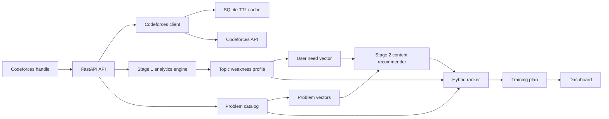

# Architecture

## Backend Modules

- `cf_client.py`: Codeforces API client, retry logic, response validation, cache integration.
- `cache.py`: SQLite TTL cache.
- `analytics.py`: Stage 1 user profile builder and weakness scoring.
- `content_recommender.py`: Stage 2 cosine similarity and KNN content recommender.
- `recommender.py`: candidate filtering, rule score, content-score blending, diversity reranking.
- `planner.py`: daily, weekly, and stretch practice blocks.
- `services.py`: orchestration for `/api/analyze/{handle}`.

## Data Flow

1. Fetch user metadata, submissions, rating history, and problemset data.
2. Deduplicate accepted problems and aggregate attempts by problem key.
3. Compute tag diagnostics: attempts, solves, wrong attempts, accuracy, average solved rating, and weakness score.
4. Build the problem catalog and remove already solved problems.
5. Keep candidate problems near the user's current growth band.
6. Build problem vectors from rating, tags, popularity, and recency.
7. Build a user need vector from inferred rating and weak tags.
8. Score candidates with cosine similarity and KNN.
9. Blend the content score with rule-based weakness/difficulty/popularity features.
10. Rerank for diversity across tags and rating bands.
11. Return dashboard-ready JSON and a weekly training plan.

## Why This Architecture Works

- Stage 1 is explainable and easy to validate.
- Stage 2 introduces recommender-system concepts without needing a large offline dataset.
- Stage 3+ can be added later with cohort mining, collaborative filtering, and rating-growth prediction.
- The public app stays simple: one FastAPI service serves both API and dashboard.

